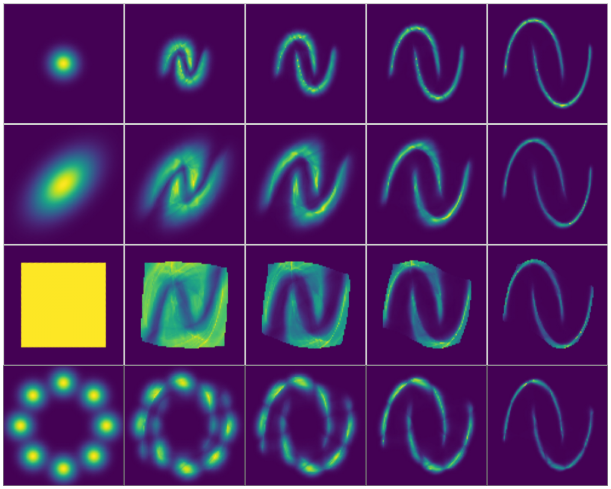
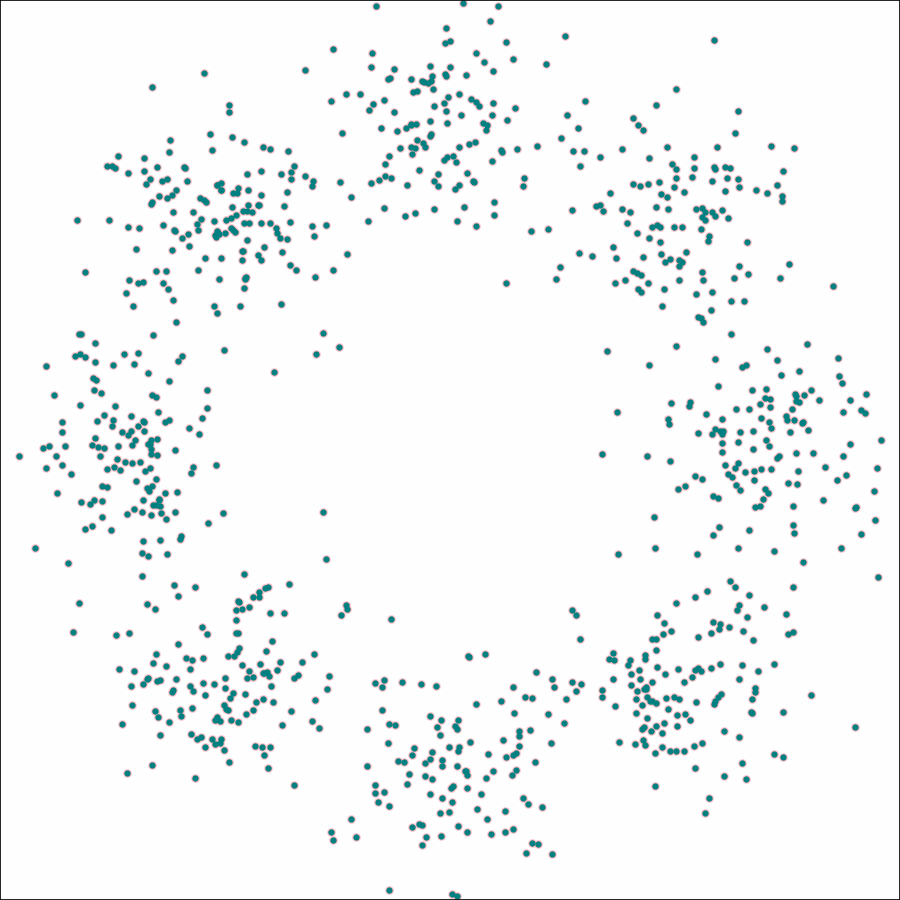

# Flow Matching with Alternative Source Distributions




<!--   -->

Based on [Francois Rozet's gist](https://gist.github.com/francois-rozet/fd6a820e052157f8ac6e2aa39e16c1aa)
and [Alexander Tong and Kilian Fatras's TorchCFM](https://github.com/atong01/conditional-flow-matching) 🙏


## Run (based on TorchCFM)

```bash
mamba activate sfm

# Make moons
sources=("8gaussians" "gamma" "beta" "cauchy" "diagonal" "laplace" "gaussian" "normal" "uniform" "mog" "multivariate" "datafittednormal")
ots=(True False)

for use_ot in "${ots[@]}"; do
    for source in "${sources[@]}"; do
        python scripts/run_cfm.py source=${source} use_ot=${use_ot} 
    done
done

# MNIST (will take overnight to train)
sources=("gamma" "beta" "diagonal" "laplace" "normal" "uniform" "mog" "multivariate" "datafittednormal" "8gaussians" "gaussian")
ots=(True False)
for use_ot in "${ots[@]}"; do
    for source in "${sources[@]}"; do
        python scripts/run_cfm.py source=${source} use_ot=${use_ot} data=mnist
    done
done

# Fit a GaussianMixtureModel and use it as source distribution
python scripts/run_cfm.py source=gmm

# Lipman flow matching (only for a Gaussian normal source)
python scripts/run_cfm.py source=normal fmloss=lipman

# Examples that don't work very well
sources=("gamma" "beta" "cauchy" "diagonal" "chi2" "dirichlet" "gumbel" "fisher" "pareto" "studentt" "lognormal")
ots=(True False)

for use_ot in "${ots[@]}"; do
    for source in "${sources[@]}"; do
        python scripts/run_cfm.py source=${source} use_ot=${use_ot} force_retrain=True
    done
done
```

## Installation

```bash
mamba env remove --name sfm -y
mamba create -n sfm python=3.11 -y
mamba activate sfm

mamba install requirements.txt -y
pip install torchcfm==0.1.0

# install torch however needed for your system
pip install torch==2.2.0+cu121 -f https://download.pytorch.org/whl/cu121/torch
pip install torchvision==0.17.0+cu121 -f https://download.pytorch.org/whl/cu121/torchvision
```

## Deprecated: FM based on Francois Rozet's gist

```bash
mamba activate sfm
```
We use hydra to manage configs. To compare different flow matching losses:
```bash
python scripts/run_fm.py.py fmloss=lipman
python scripts/run_fm.py.py fmloss=lipmantcfm
# these are the most interesting, since they work with arbitrary source distributions
python scripts/run_fm.py.py fmloss=cfm
python scripts/run_fm.py.py fmloss=otcfm
```

To plot trajectories
```bash
python scripts/run_fm.py.py fmloss=cfm n_ode=torchdyn
```

Try different source distributions:
```bash
# python scripts/run_fm.py.py fmloss=cfm source=normal logger=neptune

sources=("normal" "uniform" "beta" "laplace" "mog" "cauchy" "fisher" "studentt" "weibull" "gamma" "laplace" "gumbel")
losses=("cfm" "otcfm")
for source in "${sources[@]}"; do
    for loss in "${losses[@]}"; do
        python scripts/run_fm.py.py fmloss=${loss} source=${source} logger=neptune tags=["s1"]
    done
done
```

## TODO

- [] MNIST integrator logprob
- [] GMM on MNIST

- [] Measure (Wasserstein) distance between source and target


